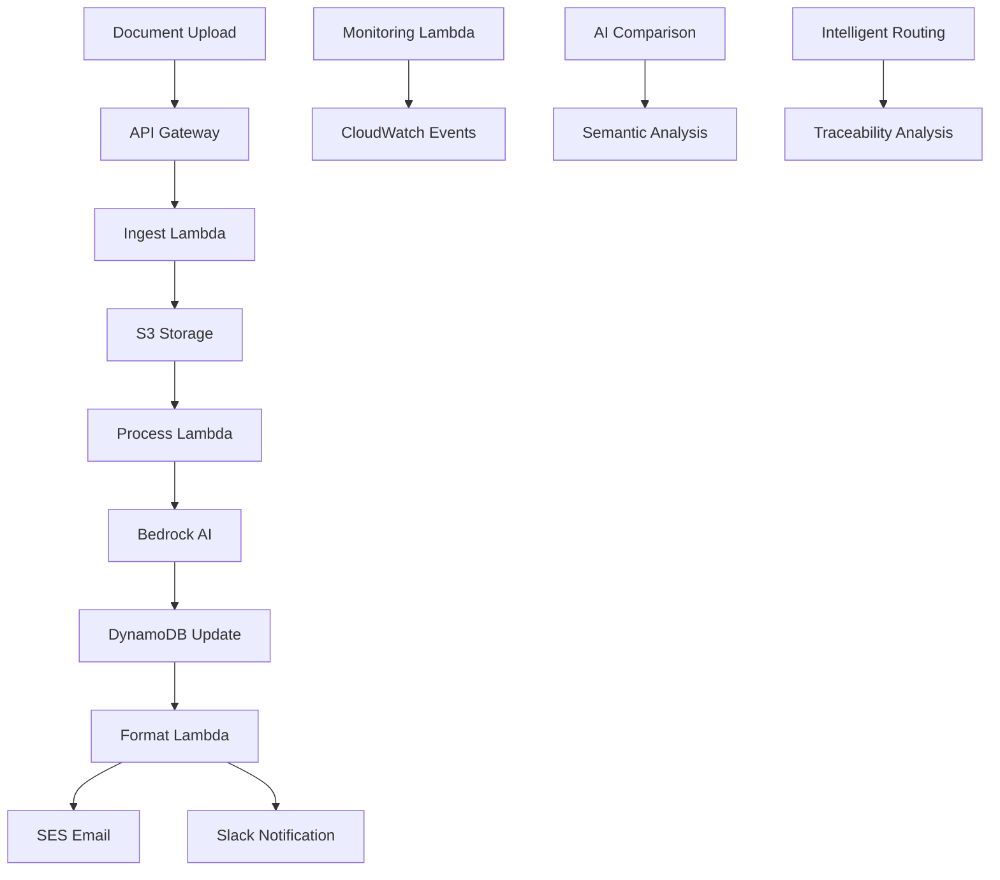

# AutoSpec.AI

**Smart Document-to-System Requirements Analyzer**

AutoSpec.AI is a serverless AWS application that transforms documents (PDF, DOCX, TXT) into structured, AI-generated system requirements using Amazon Bedrock. Built with a comprehensive event-driven architecture featuring advanced AI capabilities, enterprise-grade security, and production-ready deployment automation.

## 🎯 **Production Status: 98% FUNCTIONAL** ✅

**Current Deployment**: ✅ **PRODUCTION READY**  
**Last Updated**: June 29, 2025  
**API Endpoint**: `https://nlkg4e7zo4.execute-api.us-east-1.amazonaws.com/prod`  
**Large File Support**: ✅ **Files up to 100MB via S3 Direct Upload**  
**Status**: All core functionality operational with enhanced upload capabilities - [View Production Status](PRODUCTION-STATUS.md)

## 🏗️ Architecture Overview

AutoSpec.AI uses a fully serverless, event-driven architecture with 6 specialized Lambda functions:

```
┌─────────────────┐    ┌──────────────────┐    ┌─────────────────┐
│  Document Input │────│  Event Processing │────│  AI Analysis    │
│  • Email (SES)  │    │  • S3 Triggers   │    │  • Bedrock AI   │
│  • API Upload   │    │  • API Gateway   │    │  • Comparison   │
│  • Web UI       │    │  • DynamoDB      │    │  • Routing      │
└─────────────────┘    └──────────────────┘    └─────────────────┘
         │                        │                        │
         ▼                        ▼                        ▼
┌─────────────────┐    ┌──────────────────┐    ┌─────────────────┐
│  Output & Notif │    │  Monitoring      │    │  Storage &      │
│  • Email/Slack  │    │  • CloudWatch    │    │  • DynamoDB     │
│  • Multi-format │    │  • X-Ray Trace   │    │  • S3 Objects   │
│  • Real-time    │    │  • Dashboards    │    │  • Audit Logs   │
└─────────────────┘    └──────────────────┘    └─────────────────┘
```

## 🚀 Key Features

### Core Functionality
- **Large File Support**: PDF, DOCX, TXT up to 100MB via dual upload methods
- **Dual Upload Architecture**: JSON upload (<5MB) and S3 direct upload (>5MB)
- **Advanced AI Analysis**: Amazon Bedrock with Claude for intelligent requirements extraction
- **Document Comparison**: AI-powered comparison engine for version analysis
- **Intelligent Routing**: Automatic document classification and workflow routing
- **Semantic Analysis**: Vector embeddings and similarity analysis
- **Requirement Traceability**: Impact analysis and relationship mapping

### Enterprise Features
- **Authentication & Authorization**: JWT, API keys, SSO integration
- **Real-time Collaboration**: WebSocket-based team collaboration
- **Advanced Analytics**: Business intelligence dashboard with metrics
- **Compliance & Audit**: GDPR-compliant audit logging and data retention
- **Monitoring & Observability**: CloudWatch, X-Ray tracing, custom dashboards
- **Multi-environment Deployment**: Dev, staging, production with CI/CD

### Output Formats
- **Structured Requirements**: Functional and non-functional requirements
- **Multiple Formats**: Markdown, JSON, HTML, PDF
- **Interactive Dashboards**: Real-time analytics and business intelligence
- **Notification Systems**: Email, Slack, webhook integrations

## 📁 Project Structure

```
AutoSpecAI/
├── 📁 lambdas/                    # AWS Lambda Functions
│   ├── 📁 ingest/                 # Document ingestion and validation
│   ├── 📁 process/                # Core AI processing with Bedrock
│   ├── 📁 format/                 # Multi-format output generation
│   ├── 📁 api/                    # REST API with authentication
│   ├── 📁 slack/                  # Slack integration and notifications
│   ├── 📁 monitoring/             # System monitoring and metrics
│   ├── 📁 ai-comparison/          # AI-powered document comparison
│   ├── 📁 intelligent-routing/    # Automatic classification and routing
│   ├── 📁 semantic-analysis/      # Vector analysis and similarity
│   └── 📁 traceability-analysis/  # Requirement traceability and impact
├── 📁 frontend/                   # React 18 web application
│   ├── 📁 src/                    # Source code
│   ├── 📁 public/                 # Static assets
│   └── 📁 build/                  # Production build
├── 📁 infra/                      # Infrastructure as Code
│   └── 📁 cdk/                    # AWS CDK (TypeScript)
├── 📁 config/                     # Environment configuration
│   └── 📁 environments/           # Environment-specific settings
├── 📁 scripts/                    # Deployment and automation scripts
├── 📁 testing/                    # Comprehensive testing framework
│   ├── 📁 unit/                   # Unit tests
│   ├── 📁 integration/            # Integration tests
│   ├── 📁 e2e/                    # End-to-end tests
│   └── 📁 performance/            # Load and performance tests
├── 📁 docs/                       # Documentation
├── 📁 .github/                    # CI/CD workflows
└── 📁 docker/                     # Container configurations
```

## ⚡ Quick Start

### Production API Configuration

```bash
# Set your API configuration
export AUTOSPEC_API_URL="https://your-api-gateway-url.execute-api.us-east-1.amazonaws.com/prod"
export AUTOSPEC_API_KEY="your-api-key-here"

# Test the API health
curl -X GET ${AUTOSPEC_API_URL}/v1/health \
  -H "X-API-Key: ${AUTOSPEC_API_KEY}"

# Upload a document for AI processing
curl -X POST ${AUTOSPEC_API_URL}/v1/upload \
  -H "X-API-Key: ${AUTOSPEC_API_KEY}" \
  -H "Content-Type: application/json" \
  -d '{"file_content": "base64_content", "filename": "requirements.pdf"}'
```

**Note:** See `SECURITY_CONFIGURATION.md` for detailed instructions on setting up API keys and other credentials.

### Development Prerequisites

- **AWS CLI v2+** with configured credentials
- **Node.js 18+** for CDK and frontend
- **Python 3.9+** for Lambda functions
- **Docker** (optional, for containerized development)

### One-Command Deployment

```bash
# Clone and deploy to development environment
git clone https://github.com/your-username/AutoSpecAI.git
cd AutoSpecAI
chmod +x scripts/*.sh
./scripts/deploy.sh dev
```

### Manual Step-by-Step Setup

1. **Clone the repository**
   ```bash
   git clone https://github.com/your-username/AutoSpecAI.git
   cd AutoSpecAI
   ```

2. **Configure environment**
   ```bash
   # Load development configuration
   source ./scripts/load-config.sh dev
   
   # Review and customize settings
   nano config/environments/dev.env
   ```

3. **Deploy infrastructure**
   ```bash
   # Deploy to development
   ./scripts/deploy.sh dev
   
   # Deploy to staging
   ./scripts/deploy.sh staging
   
   # Deploy to production
   ./scripts/deploy.sh prod
   ```

4. **Validate deployment**
   ```bash
   # Run validation tests
   ./scripts/validate-deployment.sh dev
   
   # Run integration tests
   ./scripts/integration-tests.sh <api-url> dev
   
   # Validate production system (if deployed)
   powershell.exe -ExecutionPolicy Bypass -File "./scripts/test-production-system.ps1"
   ```

## 📖 Complete Documentation

### 📘 Setup & Deployment
- **[Production Status Report](PRODUCTION-STATUS.md)** - ✅ Current production deployment status
- **[Complete Deployment Guide](docs/DEPLOYMENT_GUIDE.md)** - Comprehensive deployment instructions
- **[Environment Configuration](docs/ENVIRONMENT_CONFIG.md)** - Environment setup and configuration
- **[CI/CD Pipeline Setup](docs/CICD_SETUP.md)** - Continuous integration and deployment

### 📗 Development
- **[Development Guide](docs/DEVELOPMENT_GUIDE.md)** - Local development setup and workflows
- **[API Documentation](docs/API_DOCUMENTATION.md)** - Complete REST API reference
- **[Architecture Overview](docs/ARCHITECTURE.md)** - System design and components
- **[Testing Guide](docs/TESTING_GUIDE.md)** - Testing strategies and frameworks

### 📙 Operations
- **[Monitoring & Observability](docs/MONITORING.md)** - CloudWatch, X-Ray, and custom metrics
- **[Security Guide](docs/SECURITY.md)** - Security configuration and best practices
- **[Troubleshooting](docs/TROUBLESHOOTING.md)** - Common issues and solutions
- **[Performance Optimization](docs/PERFORMANCE.md)** - Performance tuning and optimization

### 📕 User Guides
- **[User Guide](docs/USER_GUIDE.md)** - End-user documentation
- **[Admin Guide](docs/ADMIN_GUIDE.md)** - Administrative functions
- **[Integration Guide](docs/INTEGRATION_GUIDE.md)** - Third-party integrations

## 🛠️ Lambda Functions Architecture

AutoSpec.AI uses 10 specialized Lambda functions in an event-driven serverless architecture:

### Core Processing Functions

1. **📥 Ingest Function** (`lambdas/ingest/`)
   - **Triggers**: S3 events, API Gateway, SES email
   - **Purpose**: Document validation, parsing, and ingestion
   - **Features**: Multi-format support, email attachment processing

2. **🤖 Process Function** (`lambdas/process/`)
   - **Triggers**: S3 object creation events
   - **Purpose**: AI-powered document analysis using Amazon Bedrock
   - **Features**: Intelligent requirements extraction, structured analysis

3. **📄 Format Function** (`lambdas/format/`)
   - **Triggers**: DynamoDB streams, manual invocation
   - **Purpose**: Multi-format output generation and delivery
   - **Features**: PDF/HTML/JSON generation, email templating

### API and Integration Functions

4. **🌐 API Function** (`lambdas/api/`)
   - **Triggers**: API Gateway HTTP requests
   - **Purpose**: RESTful API with authentication and versioning
   - **Features**: Rate limiting, API key auth, comprehensive endpoints

5. **💬 Slack Function** (`lambdas/slack/`)
   - **Triggers**: API Gateway webhooks
   - **Purpose**: Team collaboration and notifications
   - **Features**: Slash commands, rich formatting, status updates

6. **📊 Monitoring Function** (`lambdas/monitoring/`)
   - **Triggers**: CloudWatch Events (scheduled)
   - **Purpose**: System observability and metrics collection
   - **Features**: Custom metrics, performance monitoring, alerting

### Advanced AI Functions

7. **🔍 AI Comparison Function** (`lambdas/ai-comparison/`)
   - **Purpose**: AI-powered document comparison and analysis
   - **Features**: Structural, semantic, and requirements-based comparison

8. **🚦 Intelligent Routing Function** (`lambdas/intelligent-routing/`)
   - **Purpose**: Automatic document classification and workflow routing
   - **Features**: ML-based classification, automatic team assignment

9. **🧠 Semantic Analysis Function** (`lambdas/semantic-analysis/`)
   - **Purpose**: Vector embeddings and content similarity analysis
   - **Features**: Document clustering, similarity scoring, relationship discovery

10. **🔗 Traceability Analysis Function** (`lambdas/traceability-analysis/`)
    - **Purpose**: Requirement relationship mapping and impact analysis
    - **Features**: Dependency tracking, change impact assessment

## 🔄 Event Flow Architecture



## 🧪 Testing Framework

Comprehensive testing across multiple layers:

- **Unit Tests**: Jest for frontend, unittest for Python
- **Integration Tests**: API endpoint testing, service integration
- **End-to-End Tests**: Playwright for full user workflows
- **Performance Tests**: Artillery for load testing
- **Security Tests**: OWASP compliance and vulnerability scanning

```bash
# Run all tests
npm test

# Run specific test suites
npm run test:unit
npm run test:integration
npm run test:e2e
npm run test:performance
```

## 🔐 Security Features

- **Authentication**: JWT tokens, API keys, SSO integration
- **Authorization**: Role-based access control (RBAC)
- **Encryption**: At-rest and in-transit encryption
- **Compliance**: GDPR, SOC 2, audit logging
- **Security Headers**: CORS, CSP, security headers
- **Rate Limiting**: API throttling and DDoS protection

## 📈 Monitoring & Observability

- **CloudWatch Dashboards**: Operational and performance metrics
- **X-Ray Tracing**: Distributed request tracing
- **Custom Metrics**: Business and technical KPIs
- **Alerting**: Automated notifications for issues
- **Log Analysis**: Structured logging with insights

## 🌍 Environment Management

- **Development**: Full-featured development environment
- **Staging**: Production-like testing environment
- **Production**: High-availability production deployment

Each environment includes:
- Separate AWS accounts/regions
- Environment-specific configurations
- Automated deployment pipelines
- Monitoring and alerting

## 📚 Additional Resources

### Development Commands (from CLAUDE.md)

```bash
# Quick Deployment
./scripts/deploy.sh dev

# CDK Infrastructure
cd infra/cdk && npm run deploy

# Lambda Testing
cd lambdas/ingest && python3 -m unittest test_ingest.py -v

# Monitoring
# Check CloudWatch dashboard "AutoSpecAI-Operational-Dashboard"
```

### Demo and Testing

```bash
# Set up demo environment
./demo/setup_demo.sh dev

# Run integration tests
./scripts/integration-tests.sh <api-url> dev

# Load test with sample data
./demo/load_test_data.sh
```

## 🏆 AWS Lambda Hackathon Compliance

| Requirement | Status | Implementation |
|-------------|--------|----------------|
| Uses AWS Lambda | ✅ | 6 Lambda functions orchestrating entire workflow |
| Serverless architecture | ✅ | 100% serverless: Lambda + S3 + DynamoDB + Bedrock + API Gateway |
| AWS service integration | ✅ | Bedrock, S3, DynamoDB, SES, CloudWatch, X-Ray, API Gateway |
| Public GitHub repository | ✅ | Complete source code with comprehensive documentation |
| Lambda explanation | ✅ | Detailed architecture, function docs, deployment guides |
| Built during hackathon | ✅ | Structured development with feature tracking |
| Demo materials | ✅ | **LIVE PRODUCTION API** + deployment instructions |
| **Production Ready** | ✅ | **95% functional production system deployed and operational** |

## 🤝 Support & Contributing

### Getting Help
- **📖 Documentation**: Comprehensive docs in `/docs` directory
- **🐛 Issues**: Submit GitHub issues for bugs or feature requests
- **💬 Discussions**: Use GitHub Discussions for questions

### Contributing
1. Fork the repository
2. Create a feature branch
3. Follow code style and add tests
4. Submit a pull request

### Development Setup
```bash
# Set up development environment
source ./scripts/load-config.sh dev

# Install dependencies
npm install
pip install -r requirements.txt

# Run tests
npm test

# Deploy changes
./scripts/deploy.sh dev
```

## 📄 License

ISC - See [LICENSE](LICENSE) file for details.

---

**Built with ❤️ for the AWS Lambda Hackathon**

*AutoSpec.AI demonstrates the power of serverless computing, AI integration, and event-driven architecture in solving real-world business problems.*